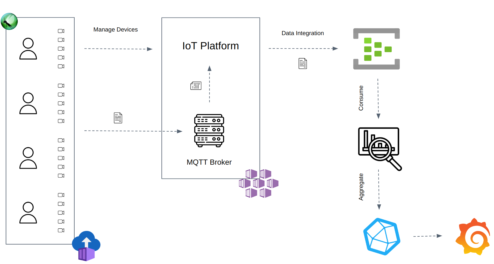
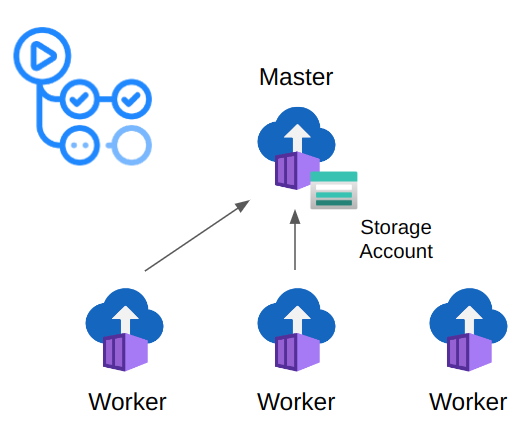
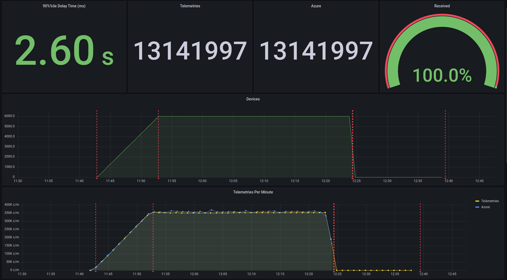

# MQTT Locust on Azure

This repository is a framework example to test an IoT system performance using [Locust](https://locust.io/). The framework uses [Azure Container Instances](https://azure.microsoft.com/en-us/products/container-instances/) to execute Locust in distributed mode.

Each device uses the Paho-MQTT client to publish telemetries to the MQTT Broker. The Consumer reads the outgoing messages from the [Azure Eventhub](https://azure.microsoft.com/es-es/products/event-hubs/#overview) and uploads the aggregated statistics to a time-series database [InfluxDB](https://www.influxdata.com/).

Finally, [Grafana](https://grafana.com/) reads the aggregated statistics to display the final dashboard with the test results.

<br/>
<br/>
<p align="center">
    
</p>
<br/>
<br/>

# Producer

The Producer wraps the [Locust](https://locust.io/) User class with the [Paho-MQTT Client](https://github.com/eclipse/paho.mqtt.python) to publish telemetries via the MQTT protocol.

## Install

```bash
$ pip install -r producer/requirements.txt
```

## Configuration

Check the [Paho-MQTT](https://github.com/eclipse/paho.mqtt.python) library to configure the MQTT User to match your broker configuration.


## Local Run

Use [Locust Command Line](https://docs.locust.io/en/stable/configuration.html) to run the Producer:

```bash
$ locust -f producer/locustfile.py --headless -u 1 -r 1 -t 2m -H test.mqtt.com
```

## Azure Run

Create an Azure Storage account with a file share named locust. Inside the file share, create two directories: stats and logs.

Dispatch the [Run Locust On Azure](https://github.com/joan-mido-qa/mqtt-locust-on-azure/actions/workflows/run_azure.yaml) workflow to deploy the Producer to [Azure Container Instances](https://azure.microsoft.com/en-us/products/container-instances/).

<br/>
<br/>
<p align="center">
    
</p>
<br/>
<br/>

## Release

Uncomment the **cd.yaml** workflow to release the producer docker.

# Consumer

The Consumer receives the [Azure Eventhub](https://azure.microsoft.com/es-es/products/event-hubs/#overview) outgoing messages, aggregates the events statistics, and dumps the data into the [InfluxDB](https://www.influxdata.com/).

## Install

```bash
$ pip install -r consumer/requirements.txt
```

## Configuration

Set up the following environment variables before starting the consumer:

```bash
$ export STORAGE_CONNECTION_STRING=""
$ export EVENTHUB_CONNECTION_STRING=""
$ export CONSUMER_GROUP=""
$ export EVENTHUB_NAME=""
$ export INFLUXDB_HOST=""
$ export INFLUXDB_TOKEN=""
$ export INFLUXDB_ORG=""
$ export NUM_PARTITION=1 # Consumer partition. ex: [0, 1] -> 1.
$ export TOTAL_PARTITION=2 # Total number of Consumers. ex: 2.
```

## Release

Uncomment the **cd.yaml** workflow to release the Consumer docker.

## Deploy

Run the [Deploy Consumer](https://github.com/joan-mido-qa/mqtt-locust-on-azure/actions/workflows/deploy_consumer.yaml) workflow to deploy the Consumer to [Azure Container Instances](https://azure.microsoft.com/en-us/products/container-instances/).

# Report

Import the JSON file from the Grafana folder. [Grafana](https://grafana.com/) uses [InfluxDB](https://www.influxdata.com/) to aggregate the statistics and measure the event ingestion delay time (ms) and the count of the EventHub outgoing messages.

Locust uses a self-developed plugin to dump into InfluxDb the number of telemetries and devices. The following image shows the final result using the plug-in, but the JSON file only contains the EventHub results.

<br/>
<br/>
<p align="center">
    
</p>
<br/>
<br/>

### Event Ingestion Delay Time (ms)

The ingestion delay time is measured as the event enqueue time minus the event sent time. Each telemetry has its send timestamp.

### Received Telemetries

Azure EventHub outgoing messages count.
